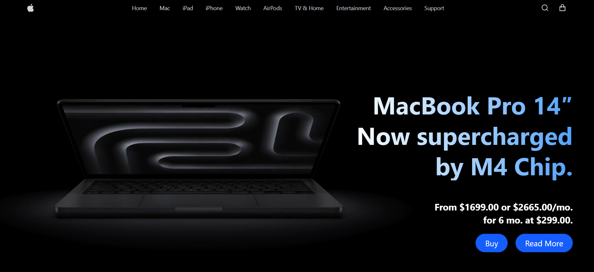
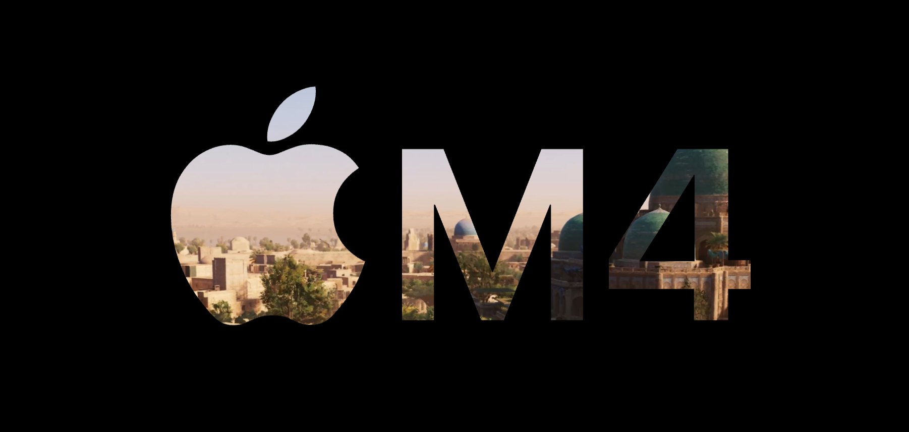

# MacBook M4 Landing Page

A modern and responsive MacBook M4-inspired landing page built with React, Vite, and Tailwind CSS. This project recreates Apple's premium design language with smooth layouts, clean typography, interactive sections, and a visually appealing user experience.

## Preview

### Hero Section



### M4 Showcase Section



## Features

- Responsive design for desktop, tablet, and mobile devices
- Modern Apple-inspired user interface
- Built with React and Vite for fast development and performance
- Styled using Tailwind CSS
- Clean component-based architecture
- Optimized layout and typography
- Interactive navigation and call-to-action sections

## Tech Stack

- React,
- Tailwind CSS,
- JavaScript,
- HTML5,
- CSS3.

## Installation

Clone the repository:

```bash
git clone https://github.com/githarsh7/MACBOOK-M4.git
```

Navigate to the project directory:

```bash
cd MACBOOK-M4
```

Install dependencies:

```bash
npm install
```

Start the development server:

```bash
npm run dev
```

## Build for Production

```bash
npm run build
```

## Project Structure

```text
MACBOOK-M4/
├── public/
├── src/
│   ├── assets/
│   ├── components/
│   ├── pages/
│   ├── App.jsx
│   └── main.jsx
├── screenshots/
│   ├── hero-section.png
│   └── m4-showcase.png
├── package.json
└── README.md
```

## Screenshots

| Landing Page | M4 Showcase |
|-------------|-------------|
|  |  |

## Future Improvements

- Product comparison section
- Smooth animations and transitions
- Dark/Light theme support
- Enhanced accessibility
- Additional Apple product showcases

## Disclaimer

This project is created for educational and portfolio purposes only. Apple, MacBook, and related trademarks belong to their respective owners.

---

## Connect with Me 🤝 :
- LinkedIn : [HARSHAA SG](https://www.linkedin.com/in/harshaasg)  
- Gmail : harshaavardhan8@gmail.com

⭐ Feel free to fork this project and improve it!

---
